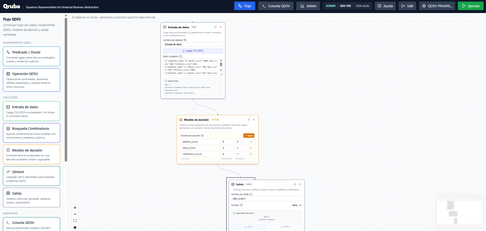

# Qruba

**Qruba** is the visual semantic computation platform powered by **QDSV**.

It helps users build auditable workflows from prepared data, problem intention, predicates, rankings, reliability policies and evidence, without forcing them to start by designing quantum circuits.

Qruba is designed for teams that want to explore quantum-ready computation in a practical way: business analysts, data teams, researchers, software engineers, innovation groups and technical decision makers.



## What Qruba Is

Qruba is a workflow platform for formulating and executing semantic computation problems.

Users work with visual nodes instead of starting from low-level quantum programming. A workflow can load prepared data, define a predicate or decision model, run QIntent, explore combinations, configure reliability policies, inspect traces and export results.

The platform is built on the QDSV model:

```text
prepared data
-> candidates
-> semantic intention
-> predicates / state spaces
-> execution route
-> evidence
```

Circuits remain valid, but in QDSV they are a possible materialization when a backend requires them. They are not the required starting point for the user.

## Why Qruba Matters

Most quantum tools ask users to think in terms of gates, circuits, encodings, ansatz choices or backend-specific programs.

Qruba starts from the problem:

- What candidates exist?
- What condition defines a valid solution?
- What should be ranked or selected?
- What evidence should be accepted?
- Which route can execute the problem?

This makes Qruba useful as a practical bridge between business or scientific problems and logical, simulated, statevector or quantum-capable execution.

## Main Capabilities

- Visual workflow builder for semantic computation.
- Prepared-data ingestion through CSV or JSON.
- Predicate and oracle construction.
- Decision and ranking workflows over prepared values.
- QIntent execution inside visual flows.
- Combinatorial search across candidate spaces.
- Semantic AI exploration for selection, routing, sampling and model-building decisions.
- Sensing evidence experiments over sensor or simulated sensor readings.
- Experimental Crypto QDSV workflows.
- Noise, reliability and mitigation policies.
- Output export and trace / verification reports.
- Cloud and private Docker deployment options.

## Core Nodes

Qruba organizes work into visual nodes. Each node represents a controlled capability of the platform.

| Node | Purpose |
|---|---|
| Dataset Input | Load prepared CSV/JSON data into the workflow. |
| Predicate / Oracle | Convert rules over prepared rows into executable predicates and oracle-ready structures. |
| Semantic Operation | Apply controlled mathematical or semantic operations to prepared values. |
| Decision Model | Build auditable selection, scoring and ranking workflows over prepared values. |
| Combinatorial Search | Explore bounded combinations across candidate spaces. |
| QIntent | Write declarative QDSV-native instructions for more flexible problem expression. |
| QDSV Console | Run commands, compile QIntent, inspect jobs, export results and review evidence. |
| Output | Review and export enriched results. |
| Traces / Verification | Inspect execution route, backend, evidence and reliability reports. |

## Experimental Nodes

Qruba also includes experimental nodes for advanced exploration.

| Node | Purpose |
|---|---|
| Semantic AI Explorer | Explore AI lifecycle decisions such as configuration search, routing, sampling, boundary evaluation and scientific ranking. |
| Crypto QDSV | Experimental semantic-quantum cryptography workflows such as challenge-response and commitments. Not production cryptography. |
| Sensing Evidence QDSV | Interpret sensor or simulated sensor readings as events, rankings, confidence and evidence. |

Experimental nodes are meant for research, pilots and controlled validation. They should not be presented as production security, production sensing certification or guaranteed quantum advantage.

## Decision, Hardware and Reliability Layers

Qruba separates semantic decisions from hardware evidence.

This matters because a workflow can produce a strong semantic result while real hardware may return noisy or incomplete physical evidence. Qruba keeps these layers visible instead of hiding them inside one metric.

Typical enriched outputs can include:

- semantic selection;
- hardware-reconstructed selection when available;
- reliability status;
- final recommended decision;
- execution route;
- backend;
- probabilities, counts or solution mass when supported;
- trace and evidence summaries.

This separation helps users avoid confusing semantic accuracy with hardware-confirmed reliability.

## Access

- **Qruba Cloud:** [https://cloud.qruba.site/](https://cloud.qruba.site/)
- **Private Docker access:** [https://qruba.site/](https://qruba.site/) when the private node is available
- **QDSV model site:** [https://qdsv.cloud/](https://qdsv.cloud/)
- **QIntent SDK:** [https://github.com/qdsvquantum-afk/qintent](https://github.com/qdsvquantum-afk/qintent)
- **QDSV Bridge SDK:** [https://github.com/qdsvquantum-afk/qdsv-bridge](https://github.com/qdsvquantum-afk/qdsv-bridge)

## Public Project Scope

This repository is a public product page and documentation space for Qruba.

It does not include:

- private QDSV runtime;
- Qruba platform source code;
- CAP internals;
- backend orchestration;
- lowering logic;
- QuEST/Aer/IBM adapters;
- infrastructure secrets;
- production configuration;
- proprietary execution components.

## Learn More

- [Getting started](./docs/GETTING_STARTED.md)
- [Node overview](./docs/NODES.md)
- [Access, privacy and deployment](./docs/ACCESS_PRIVACY.md)
- [EEG thesis comparison case study](./docs/CASE_STUDY_EEG_THESIS.md)
- [FAQ](./docs/FAQ.md)

## Contact

For pilots, research collaboration, technical integration or investment conversations, use the contact form on:

[https://qdsv.cloud/](https://qdsv.cloud/)
